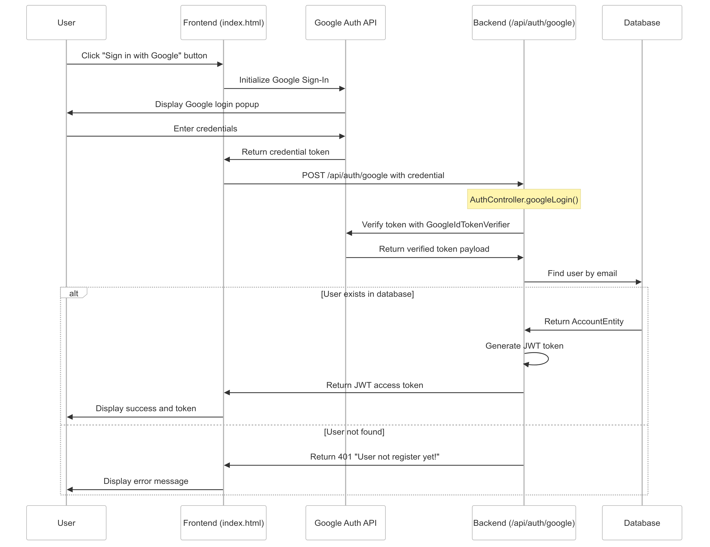

# Week 5
## Login Google
* Install google auth library
```
 <project>
  <dependencies>
   <dependency>
     <groupId>com.google.api-client</groupId>
     <artifactId>google-api-client</artifactId>
     <version>1.32.1</version>
   </dependency>
  </dependencies>
 </project>
```
* Run the Front End ([Install NodeJS](https://nodejs.org/en) before run):
```shell
# Install HTTP Server (install once)
npm i -g http-server

# Run this when you want to run the Front End
http-server -p 3000
```
_Note:_


* Set up Google OAuth Client


* [Get the Login with Google button](https://developers.google.com/identity/gsi/web/tools/configurator)
* Replace the Google Client ID in the Front-End


* Replace `qltc.google.client_id` in `application.properties`
```properties
qltc.google.client_id=your google client_id
```
* Update QLTC Config
```java
@Configuration
@Import(QltcSecurityConfiguration.class)
@Data
public class QltcConfiguration {
    @Value("${qltc.jwt.secret}")
    private String jwtSecret;

    @Value("${qltc.jwt.issuer}")
    private String jwtIssuer;

    @Value("${qltc.google.client_id}")
    private String googleClientId;
} 
```
* Add `GoogleLoginDto` to `modules/auth/dto`
```java
@Data
public class GoogleLoginDto {
    private String credential;
}
```
* Add `googleLogin()` to `AuthService`
```java
@Service
public class AuthService {
    // ...

    public String googleLogin(GoogleLoginDto dto) {
        GoogleIdTokenVerifier verifier = new GoogleIdTokenVerifier.Builder(new NetHttpTransport(), GsonFactory.getDefaultInstance())
                .setAudience(Collections.singletonList(configuration.getGoogleClientId()))
                .build();

        GoogleIdToken idToken = null;
        try {
            idToken = verifier.verify(dto.getCredential());
        } catch (Exception e) {
            e.printStackTrace();
            throw new ResponseStatusException(HttpStatus.INTERNAL_SERVER_ERROR, e.getMessage());
        }
        if (idToken != null) {
            GoogleIdToken.Payload payload = idToken.getPayload();

            String email = payload.getEmail();
            Optional<AccountEntity> result = accountRepository.findByEmail(email);
            if (result.isEmpty()) {
                throw new ResponseStatusException(HttpStatus.UNAUTHORIZED, "User not register yet!");
            }
            AccountEntity account = result.get();
            return signJwtToken(account);
        } else {
            throw new ResponseStatusException(HttpStatus.INTERNAL_SERVER_ERROR, "ID Token is null");
        }
    }
}
```
* Add `loginGoogle()` to `AuthController` with route `POST /api/auth/google`
```java
@RestController
@RequestMapping("/api/auth")
public class AuthController {
    // ...

    @PostMapping("/google")
    private ResponseEntity googleLogin(@RequestBody GoogleLoginDto dto) {
        String accessToken = authService.googleLogin(dto);
        return new ResponseEntity(new HashMap<String, Object>() {{ put("accessToken", accessToken); }}, HttpStatus.CREATED);
    }
}
```
* Go to [http://localhost:3000](http://localhost:3000) to check the result


## Full Login Google Flow
